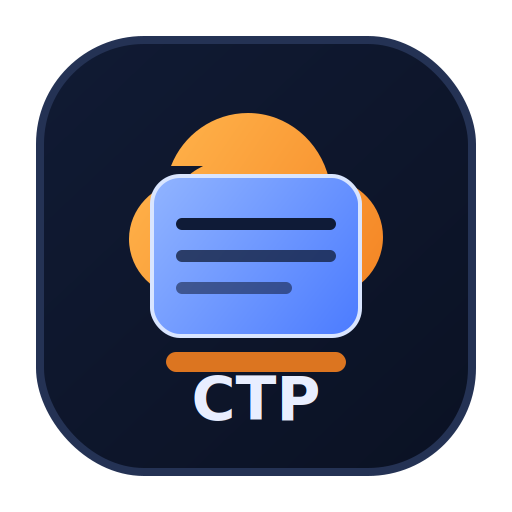
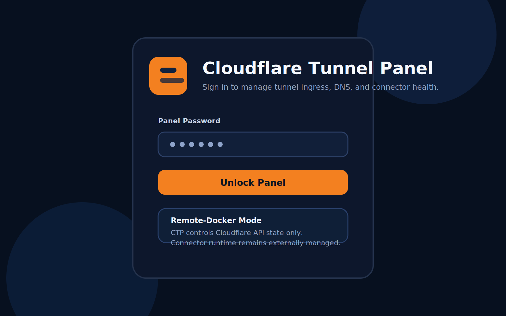
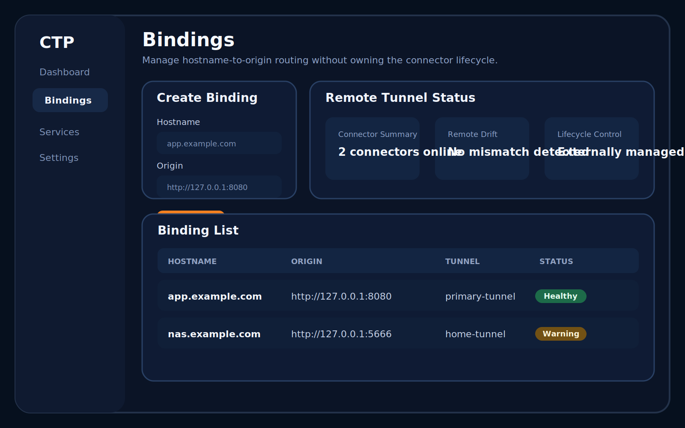
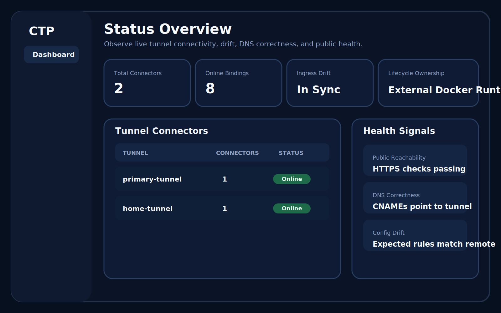
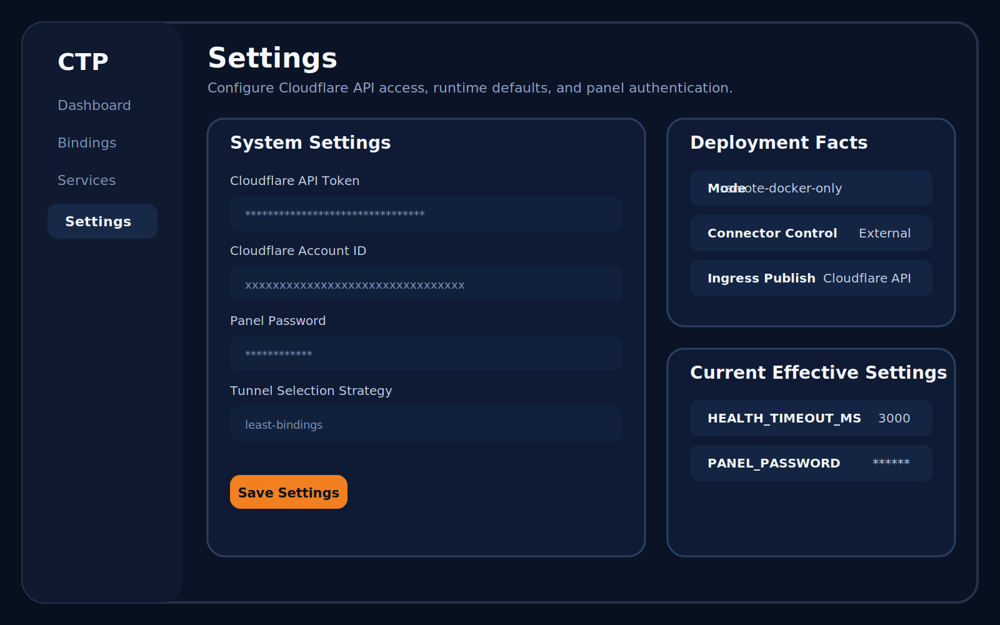
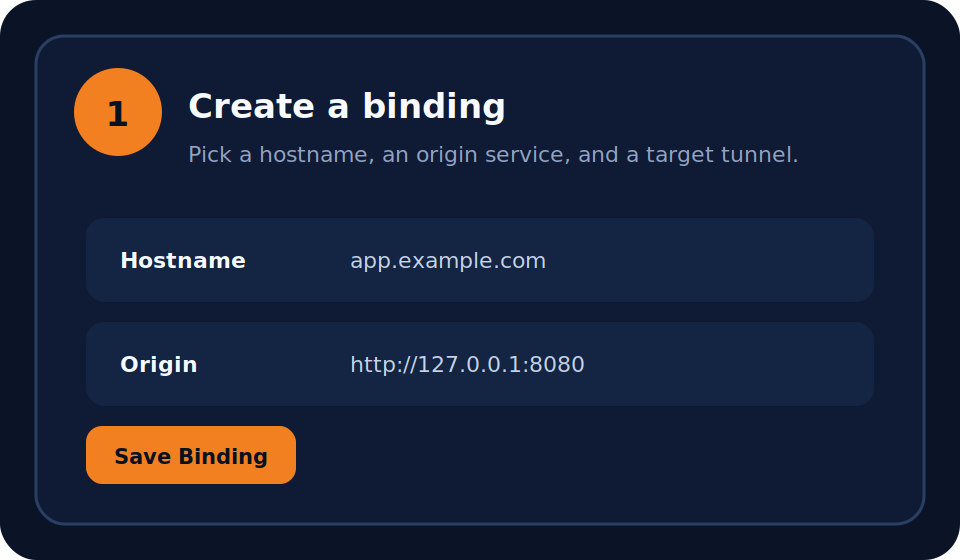
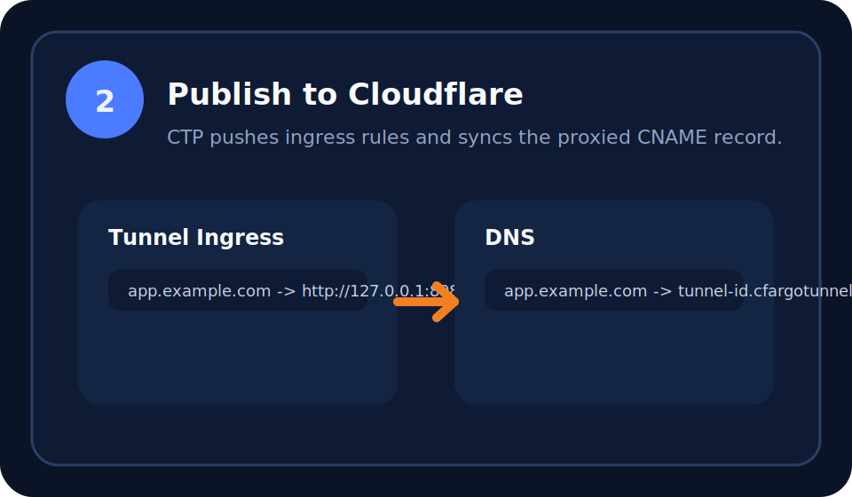
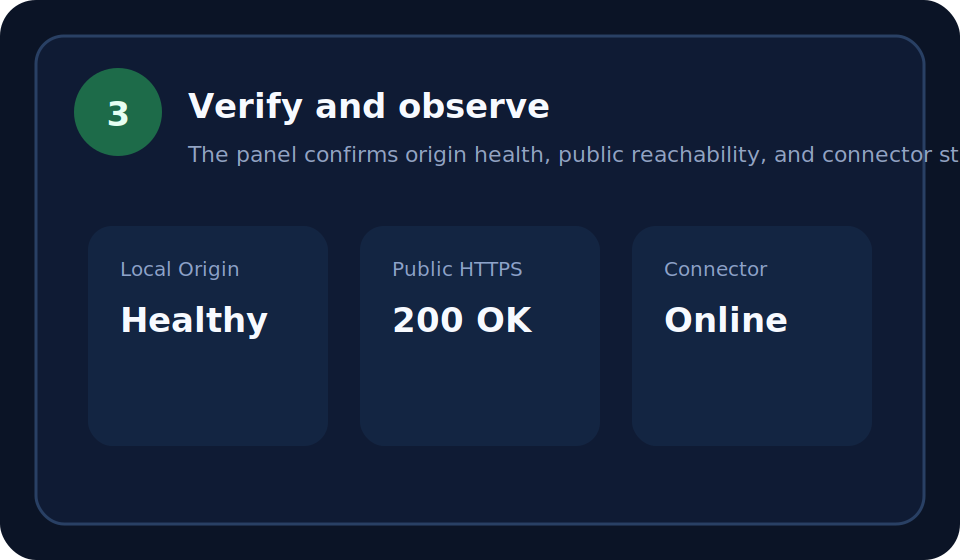
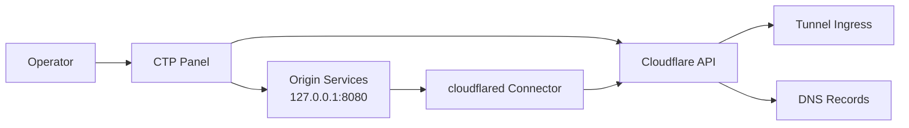

<p align="center">
  
</p>

<h1 align="center">Cloudflare Tunnel Panel</h1>

<p align="center">
  <strong>Remote-docker control plane for Cloudflare Tunnel ingress, DNS, and connector observability.</strong>
</p>

<p align="center">
  Manage hostname bindings, publish ingress through the Cloudflare API, and observe tunnel health without turning the panel into a Docker orchestrator.
</p>

<p align="center">
  <a href="./README.md">English</a> · <a href="./README.zh-CN.md">简体中文</a>
</p>

<p align="center">
  <a href="./LICENSE"></a>
  
  
  
</p>

## At a glance

Cloudflare Tunnel Panel (CTP) is built for teams and self-hosted operators who
want one place to manage:

- `hostname -> origin` bindings
- Cloudflare Tunnel ingress rules
- proxied DNS records
- connector health and public reachability

CTP intentionally does **not** own the `cloudflared` container lifecycle.
Instead, it focuses on Cloudflare-side state and runtime observability.

## Interface preview

| Login | Bindings |
| --- | --- |
|  |  |

| Status | Settings |
| --- | --- |
|  |  |

## Common use cases

| Scenario | What CTP helps with |
| --- | --- |
| Home NAS reverse proxy | Publish services like `nas.example.com -> http://127.0.0.1:5666` through a remote-managed tunnel. |
| Multi-service tunnel management | Keep many hostname bindings in one panel instead of scattering config across manual tunnel edits. |
| Cloudflare-only control plane | Manage ingress and DNS through the Cloudflare API while leaving Docker runtime ownership outside the panel. |

## Why this project exists

Many setups start with one of two extremes:

- `cloudflared tunnel run --url ...`
- manually editing Cloudflare Tunnel and DNS in the dashboard

Both approaches work for small setups, but they get harder to reason about once
you have multiple services, multiple hostnames, and a need for health signals.
CTP is designed to sit in the middle:

- opinionated enough to keep bindings organized
- narrow enough to avoid Docker socket access and lifecycle sprawl

## Feature comparison

| Capability | CTP | `cloudflared --url` only | Manual Cloudflare edits |
| --- | --- | --- | --- |
| Multi-hostname binding management | Yes | Limited | Manual |
| Remote ingress publishing | Yes | No | Yes |
| DNS record synchronization | Yes | No | Manual |
| Connector status visibility | Yes | Minimal | Partial |
| Origin and public health checks | Yes | No | No |
| Drift detection | Yes | No | No |
| Docker lifecycle ownership | No | External | External |
| Good operator UX at scale | Yes | Low | Low |

## Quick demo

| Step 1 | Step 2 | Step 3 |
| --- | --- | --- |
|  |  |  |

1. Create a binding by choosing a hostname, origin service, and tunnel.
2. Let CTP push ingress rules and sync the proxied CNAME through the Cloudflare API.
3. Verify local origin health, public HTTPS reachability, and connector status from the panel.

## Runtime model

This repository supports one deployment model:

- `remote-docker-only`

Recommended runtime topology:

- `ctp` container: control plane and health checks
- `cloudflared` container: `tunnel --no-autoupdate run`
- both services use `network_mode: host`

That host-networked model keeps existing targets such as
`http://127.0.0.1:8080` working from both containers without relying on
`host.docker.internal`.

## Architecture



## Responsibility split

CTP manages:

- Cloudflare tunnel ingress configuration
- proxied DNS records pointing to `<tunnel-id>.cfargotunnel.com`
- binding state and health metadata
- drift detection and connector observation

CTP does not manage:

- `docker start`, `docker stop`, or `docker restart`
- the host `cloudflared` binary
- `/etc/cloudflared/config.yml`
- `systemctl`
- PID files or local reload hooks

## Prerequisites

- Docker Engine with the Compose plugin
- A Cloudflare account with at least one zone
- A remote-managed Cloudflare Tunnel
- A Cloudflare API token with:
  - `Zone Read`
  - `DNS Read`
  - `DNS Edit`
  - `Cloudflare Tunnel Read`
  - `Cloudflare Tunnel Edit`
- A connector token for the `cloudflared` container

## Quick start

1. Copy the example environment files.

   ```bash
   cp .env.production.example .env.production
   cp .env.cloudflared.example .env.cloudflared
   ```

2. Fill in the required values.

   `.env.production`

   ```env
   NODE_ENV=production
   PORT=3000
   HOSTNAME=0.0.0.0
   DATABASE_URL=/app/data/app.db
   CLOUDFLARE_API_TOKEN=
   CLOUDFLARE_ACCOUNT_ID=
   HEALTH_TIMEOUT_MS=3000
   TUNNEL_SELECTION_STRATEGY=least-bindings
   SERVICE_DISCOVERY_DOCKER_ENABLED=false
   SERVICE_DISCOVERY_SYSTEMD_ENABLED=false
   PANEL_PASSWORD=
   ```

   `.env.cloudflared`

   ```env
   TUNNEL_TOKEN=
   ```

3. Build and start the stack.

   ```bash
   docker compose build ctp
   docker compose up -d
   ```

4. Open the panel at `http://127.0.0.1:<PORT>`.

## FAQ

### Why does `cloudflared` still need `TUNNEL_TOKEN`?

Because CTP manages Cloudflare-side configuration, not connector identity.
`TUNNEL_TOKEN` is what lets the running `cloudflared` container attach to a
specific remote-managed tunnel and actually proxy traffic back to your origins.

### Why not mount the Docker socket and control containers directly?

That would expand CTP from a Cloudflare control plane into a container runtime
manager. The current design deliberately avoids that security and operational
coupling. CTP observes the connector, but Docker remains responsible for
starting and restarting it.

### Why use `network_mode: host`?

Because it keeps host-local targets such as `http://127.0.0.1:8080` valid from
inside both the `ctp` and `cloudflared` containers. That removes a lot of
special-case networking logic and keeps service health checks aligned with the
actual deployment host.

## Local development

```bash
npm ci
npm run lint
npm run build
```

## Scope and non-goals

This repository intentionally does not try to become a container orchestrator.

Out of scope:

- Docker socket integration
- container lifecycle management from the panel
- local `cloudflared` config file generation
- `systemd` integration
- host binary installation or upgrade workflows

## Repository safety

- Example environment files are safe placeholders
- real `.env` files, logs, databases, and local workspace data are ignored by
  git
- public docs use generic hostnames, paths, and deployment examples

## License

This project is released under the [MIT License](./LICENSE).

## Additional docs

- [简体中文 README](./README.zh-CN.md)
- [Deployment Guide](./DEPLOYMENT.md)
- [Remote Docker Connector Design](./REMOTE_DOCKER_CONNECTOR_DESIGN.md)
- [Roadmap](./ROADMAP.md)
- [Release Checklist](./RELEASE_CHECKLIST.md)
- [Security Policy](./SECURITY.md)
