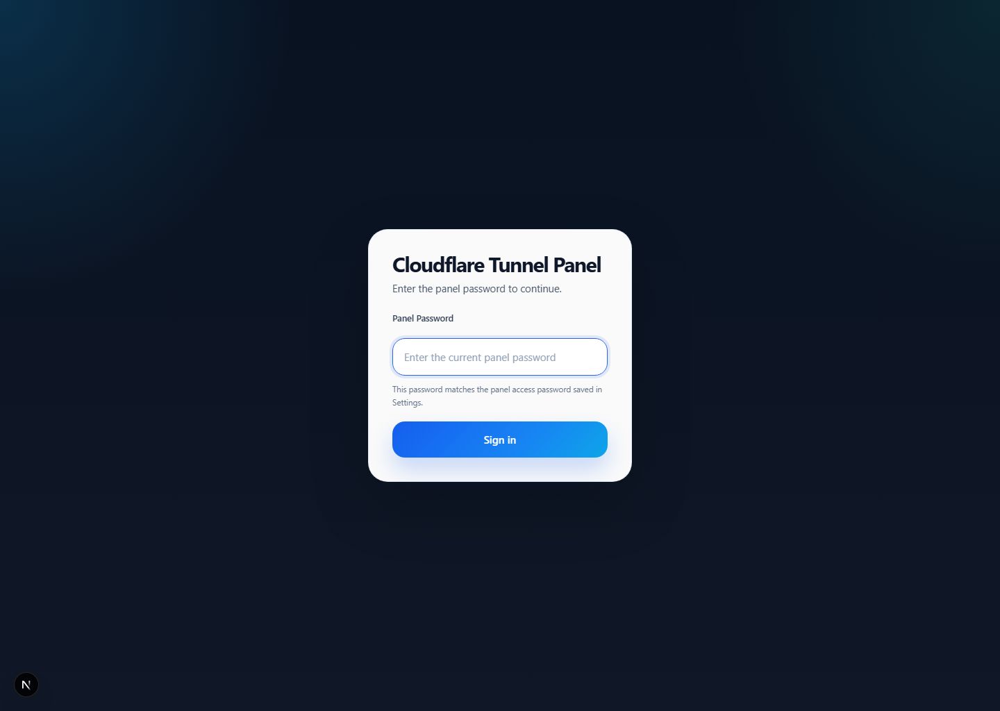
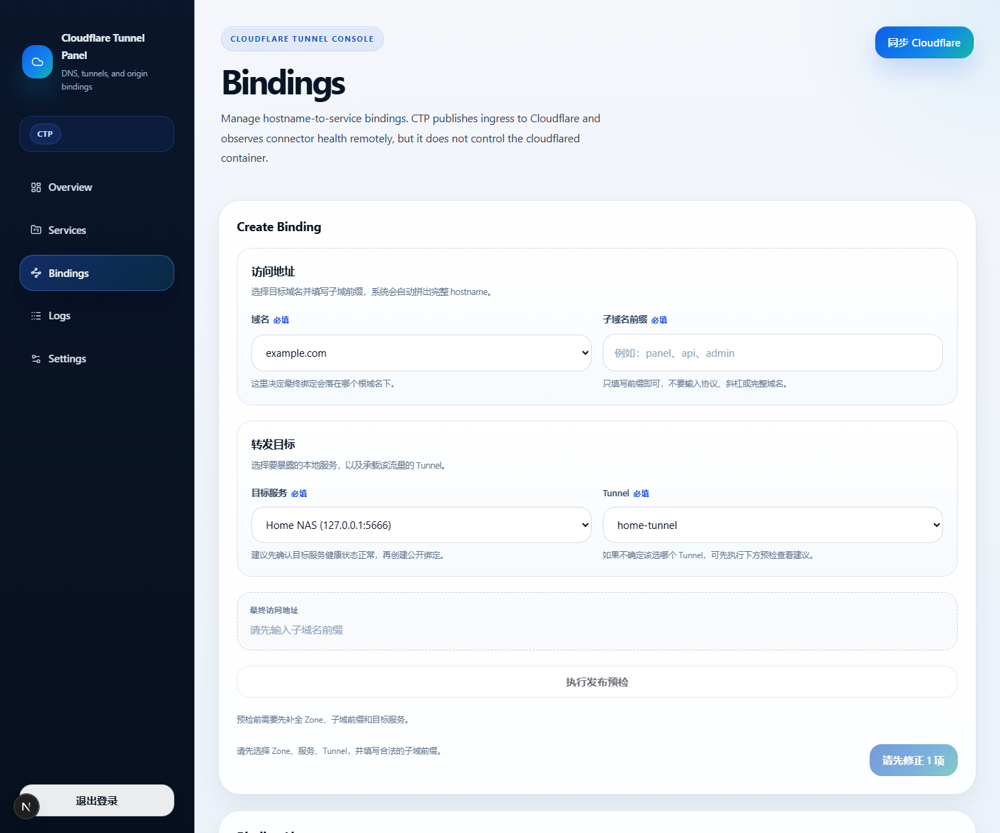
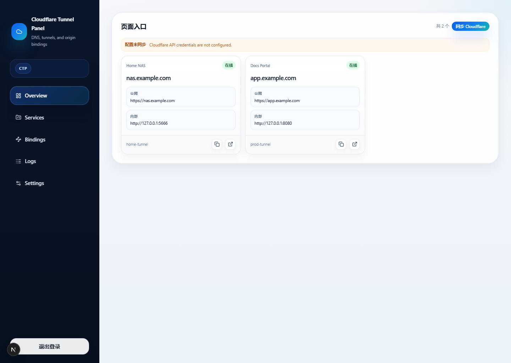
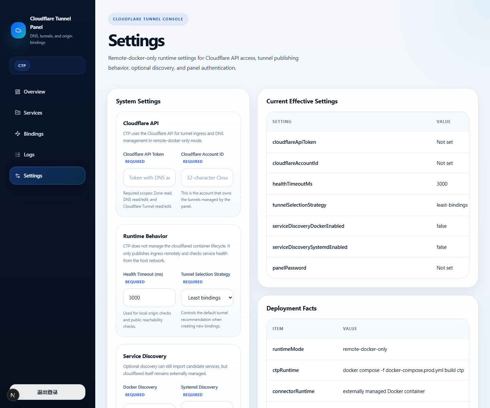
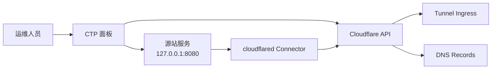

<p align="center">
  
</p>

<h1 align="center">Cloudflare Tunnel Panel</h1>

<p align="center">
  <strong>一个面向 remote-docker 场景的 Cloudflare Tunnel 控制面板。</strong>
</p>

<p align="center">
  用来管理域名绑定、发布 Tunnel ingress、同步 DNS，并观察连接器状态；但不把自己做成 Docker 编排器。
</p>

<p align="center">
  <a href="./README.md">English</a> · <a href="./README.zh-CN.md">简体中文</a>
</p>

<p align="center">
  <a href="./LICENSE"></a>
  
  
  
</p>

## 一眼看懂

Cloudflare Tunnel Panel，简称 CTP，适合这样一类场景：

- 你想统一管理 `hostname -> origin` 绑定关系
- 你想通过 Cloudflare API 管理 Tunnel ingress 和 DNS
- 你希望看到连接器在线状态和公网可达性
- 但你不想让面板自己接管 `cloudflared` 容器的启动、停止和重启

CTP 的设计边界非常明确：

- 管 Cloudflare 侧配置
- 管绑定关系和健康状态
- 不负责 Docker 生命周期

## 界面预览

下面这些截图不是来自真实线上环境，而是由一份脱敏的演示数据库生成的。

<p>
  
  
</p>

<p>
  
  
</p>

## 典型使用场景

| 场景 | CTP 能帮你做什么 |
| --- | --- |
| 家庭 NAS 反代 | 例如把 `nas.example.com -> http://127.0.0.1:5666` 通过远程托管 Tunnel 发布出去。 |
| 多服务统一 Tunnel 管理 | 把多个域名绑定集中到一个面板里，而不是分散在手工 Tunnel 配置里。 |
| 只管 Cloudflare，不碰 Docker 生命周期 | 让 CTP 只管理 ingress、DNS 和观测状态，把容器启动重启交给 Docker 或外部运维流程。 |

## 为什么会有这个项目

很多部署一开始只有两种办法：

- 直接跑 `cloudflared tunnel run --url ...`
- 在 Cloudflare 后台手工维护 Tunnel 和 DNS

当服务数量变多、域名变多、需要健康状态和可观测性时，这两种方式都会开始变乱。
CTP 想解决的就是中间这块空白：

- 比纯命令行更可管理
- 比纯手工操作更可追踪
- 又不会膨胀成一个 Docker 管理平台

## 功能对比

| 能力 | CTP | 直接 `cloudflared --url` | 手工改 Cloudflare |
| --- | --- | --- | --- |
| 多域名绑定管理 | 支持 | 很弱 | 手工 |
| 远程 ingress 发布 | 支持 | 不支持 | 支持 |
| DNS 记录同步 | 支持 | 不支持 | 手工 |
| 连接器状态可见性 | 支持 | 很弱 | 部分可见 |
| 源站与公网健康检查 | 支持 | 不支持 | 不支持 |
| 漂移检测 | 支持 | 不支持 | 不支持 |
| 面板接管 Docker 生命周期 | 不接管 | 不涉及 | 不涉及 |
| 适合多服务长期维护 | 适合 | 一般 | 一般 |

## 三步完成一次发布

| 第一步 | 第二步 | 第三步 |
| --- | --- | --- |
|  |  |  |

1. 先创建绑定，指定域名、源站和目标 Tunnel。
2. 让 CTP 通过 Cloudflare API 推送 ingress，并同步代理 CNAME。
3. 在面板里检查本地源站健康、公网 HTTPS 可达性和连接器状态。

## 运行模型

这个仓库目前只支持一种部署模式：

- `remote-docker-only`

推荐运行拓扑：

- `ctp` 容器：控制面板和健康检查
- `cloudflared` 容器：执行 `tunnel --no-autoupdate run`
- 两个服务都使用 `network_mode: host`

这种 host 网络模式可以让诸如 `http://127.0.0.1:8080` 这样的宿主机本地服务，
在 `ctp` 和 `cloudflared` 容器里都保持可访问，不需要额外依赖
`host.docker.internal`。

## 架构说明



## 职责边界

CTP 负责：

- 管理 Cloudflare Tunnel ingress 配置
- 管理指向 `<tunnel-id>.cfargotunnel.com` 的代理 DNS 记录
- 保存绑定状态和健康信息
- 检测远端 ingress 漂移和连接器状态

CTP 不负责：

- `docker start`、`docker stop`、`docker restart`
- 宿主机 `cloudflared` 二进制管理
- `/etc/cloudflared/config.yml`
- `systemctl`
- PID 文件或本地 reload 脚本

## 部署前提

- 已安装 Docker Engine 和 Docker Compose 插件
- 有一个 Cloudflare 账号，并至少托管了一个 zone
- 已创建远程托管的 Cloudflare Tunnel
- 有一个具备以下权限的 Cloudflare API Token：
  - `Zone Read`
  - `DNS Read`
  - `DNS Edit`
  - `Cloudflare Tunnel Read`
  - `Cloudflare Tunnel Edit`
- 有一个给 `cloudflared` 使用的连接器 token

## 快速开始

1. 复制示例环境变量文件。

   ```bash
   cp .env.production.example .env.production
   cp .env.cloudflared.example .env.cloudflared
   ```

2. 填写必须的配置。

   `.env.production`

   ```env
   NODE_ENV=production
   PORT=3000
   HOSTNAME=0.0.0.0
   DATABASE_URL=/app/data/app.db
   CLOUDFLARE_API_TOKEN=
   CLOUDFLARE_ACCOUNT_ID=
   HEALTH_TIMEOUT_MS=3000
   TUNNEL_SELECTION_STRATEGY=least-bindings
   SERVICE_DISCOVERY_DOCKER_ENABLED=false
   SERVICE_DISCOVERY_SYSTEMD_ENABLED=false
   PANEL_PASSWORD=
   ```

   `.env.cloudflared`

   ```env
   TUNNEL_TOKEN=
   ```

3. 构建并启动服务。

   ```bash
   docker compose build ctp
   docker compose up -d
   ```

4. 打开 `http://127.0.0.1:<PORT>` 访问面板。

## FAQ

### 为什么 `cloudflared` 还需要 `TUNNEL_TOKEN`？

因为 CTP 负责的是 Cloudflare 侧配置，不负责连接器身份本身。
`TUNNEL_TOKEN` 的作用是让运行中的 `cloudflared` 容器，以某个特定 Tunnel 的连接器身份接入 Cloudflare，
从而真正把流量代理回你的源站。

### 为什么不用 Docker Socket，直接控制容器？

因为那会让 CTP 从“Cloudflare 控制面板”膨胀成“容器运行时管理器”。
当前设计就是有意避免这种安全和职责耦合。CTP 只观察连接器，不负责启动和重启它。

### 为什么要用 `network_mode: host`？

因为这样可以让 `http://127.0.0.1:8080` 这种宿主机本地地址，在 `ctp` 和 `cloudflared`
容器里都保持一致可访问。这样网络模型更简单，服务健康检查也更贴近真实部署。

## 本地开发

```bash
npm ci
npm run lint
npm run build
```

## 范围和非目标

这个项目有意不把自己做成一个容器编排系统。

明确不做的事情包括：

- 挂载 Docker Socket
- 从面板直接管理容器生命周期
- 重新接管本地 `cloudflared` 配置文件生成
- 恢复 `systemd` 作为主要部署路径
- 管理宿主机上的二进制安装和升级

## 仓库公开安全性

- 示例环境文件只保留占位符
- 真实 `.env`、日志、数据库和本地工作目录已加入 git ignore
- 对外文档使用的是通用域名、通用路径和通用示例

## 开源协议

项目采用 [MIT License](./LICENSE)。

## 更多文档

- [English README](./README.md)
- [Deployment Guide](./DEPLOYMENT.md)
- [Remote Docker Connector Design](./REMOTE_DOCKER_CONNECTOR_DESIGN.md)
- [贡献指南](./CONTRIBUTING.md)
- [Roadmap](./ROADMAP.md)
- [Release Checklist](./RELEASE_CHECKLIST.md)
- [README 资产生成流程](./docs/README_ASSETS.md)
- [Security Policy](./SECURITY.md)
