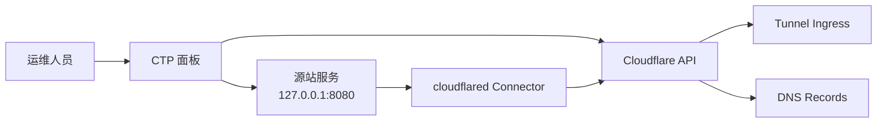

# Cloudflare Tunnel Panel

[English](./README.md) | [简体中文](./README.zh-CN.md)

[](./LICENSE)
[](https://www.docker.com/)
[](https://nextjs.org/)
[](https://www.cloudflare.com/products/tunnel/)

Cloudflare Tunnel Panel，简称 CTP，是一个面向 Docker 部署的
Cloudflare Tunnel 控制面板。它负责管理域名绑定、Tunnel ingress 和
DNS 记录，但不接管 `cloudflared` 连接器本身的运行时生命周期。

当前项目形态下：

- `ctp` 运行在 Docker 中
- `cloudflared` 也运行在 Docker 中，但被视为外部运行时
- CTP 只通过 Cloudflare API 管理 Tunnel ingress 和 DNS
- CTP 负责观察连接器状态、DNS 状态和公网可达性
- CTP 不管理 Docker 生命周期，不写宿主机 `cloudflared` 配置，也不依赖 `systemd`

## 这个项目解决什么问题

很多自托管场景都希望有一个统一入口来管理：

- `hostname -> origin` 绑定关系
- Cloudflare Tunnel ingress 规则
- 代理 CNAME DNS 记录
- 连接器在线状态与公网可达性

但并不希望管理面板本身变成一个 Docker 编排器。CTP 的设计边界就是：

- 管 Cloudflare 侧配置
- 管绑定关系与健康状态
- 不负责 `cloudflared` 容器的启动、停止和重启

## 主要特性

- 创建、更新、删除域名到源站的绑定
- 通过 Cloudflare Tunnel API 发布 ingress 规则
- 自动创建和更新代理 CNAME 记录
- 基于 Cloudflare Tunnel 状态判断连接器是否在线
- 检查本地源站健康状态和公网 HTTPS 可达性
- 检测面板期望配置与远端 ingress 的漂移
- 以独立 Next.js 生产镜像方式运行在 Docker 中

## 运行模型

这个仓库目前只支持一种部署模式：

- `remote-docker-only`

推荐运行拓扑：

- `ctp` 容器：控制面板和健康检查
- `cloudflared` 容器：执行 `tunnel --no-autoupdate run`
- 两个服务都使用 `network_mode: host`

这种 host 网络模式的好处是：

- 现有源站地址，例如 `http://127.0.0.1:8080`，在两个容器里都能直接访问
- 不需要依赖 `host.docker.internal`

## 架构说明



## 职责边界

CTP 负责：

- 管理 Cloudflare Tunnel ingress 配置
- 管理指向 `<tunnel-id>.cfargotunnel.com` 的代理 DNS 记录
- 保存绑定状态和健康信息
- 检测远端 ingress 漂移和连接器状态

CTP 不负责：

- `docker start`、`docker stop`、`docker restart`
- 宿主机 `cloudflared` 二进制管理
- `/etc/cloudflared/config.yml`
- `systemctl`
- PID 文件或本地 reload 脚本

## 为什么 `cloudflared` 仍然需要 `TUNNEL_TOKEN`

CTP 虽然可以通过 Cloudflare API 管理 Tunnel 配置，但真正负责承载流量的，
仍然是运行中的 `cloudflared` 连接器。

`TUNNEL_TOKEN` 的作用是让 `cloudflared` 容器能够以某个特定 Tunnel 的连接器身份接入 Cloudflare。
如果没有这个 token：

- CTP 仍然可以创建 DNS 记录
- CTP 仍然可以更新 ingress 规则
- 但不会有真实在线的连接器来把流量转回你的源站

## 部署前提

- 已安装 Docker Engine 和 Docker Compose 插件
- 有一个 Cloudflare 账号，并至少托管了一个 zone
- 已创建远程托管的 Cloudflare Tunnel
- 有一个具备以下权限的 Cloudflare API Token：
  - `Zone Read`
  - `DNS Read`
  - `DNS Edit`
  - `Cloudflare Tunnel Read`
  - `Cloudflare Tunnel Edit`
- 有一个给 `cloudflared` 使用的连接器 token

## 快速开始

1. 复制示例环境变量文件。

   ```bash
   cp .env.production.example .env.production
   cp .env.cloudflared.example .env.cloudflared
   ```

2. 填写必须的配置。

   `.env.production`

   ```env
   NODE_ENV=production
   PORT=3000
   HOSTNAME=0.0.0.0
   DATABASE_URL=/app/data/app.db
   CLOUDFLARE_API_TOKEN=
   CLOUDFLARE_ACCOUNT_ID=
   HEALTH_TIMEOUT_MS=3000
   TUNNEL_SELECTION_STRATEGY=least-bindings
   SERVICE_DISCOVERY_DOCKER_ENABLED=false
   SERVICE_DISCOVERY_SYSTEMD_ENABLED=false
   PANEL_PASSWORD=
   ```

   `.env.cloudflared`

   ```env
   TUNNEL_TOKEN=
   ```

3. 构建并启动服务。

   ```bash
   docker compose build ctp
   docker compose up -d
   ```

4. 打开 `http://127.0.0.1:<PORT>` 访问面板。

## Docker 部署说明

仓库内已经包含：

- `Dockerfile`：CTP 生产镜像构建文件
- `docker-compose.yml`：运行栈定义
- `docker-compose.prod.yml`：等效生产 compose 文件

示例部署路径：

```text
/opt/cloudflare-tunnel-panel
```

如果宿主机的 `3000` 端口已被占用，可以在 `.env.production` 中调整 `PORT`。
因为 compose 健康检查会自动读取这个端口，所以不需要再额外改 compose 文件。

## 一个绑定发布的示例

对于下面这样的绑定：

- 域名：`app.example.com`
- 源站：`http://127.0.0.1:8080`

CTP 会执行：

1. 将 ingress 规则发布到选定 Tunnel
2. 创建或更新代理 CNAME
3. 从 `ctp` 容器内部检查本地源站可达性
4. 通过 Cloudflare 检查公网 HTTPS 可达性
5. 展示连接器状态和绑定健康状态

如果 `cloudflared` 容器停止，CTP 会把状态显示为降级或离线，但不会尝试自动重启容器。

## 本地开发

```bash
npm ci
npm run lint
npm run build
```

## 范围和非目标

这个项目有意不把自己做成一个容器编排系统。

明确不做的事情包括：

- 挂载 Docker Socket
- 从面板直接管理容器生命周期
- 重新接管本地 `cloudflared` 配置文件生成
- 恢复 `systemd` 作为主要部署路径
- 管理宿主机上的二进制安装和升级

## 仓库公开安全性

- 示例环境文件只保留占位符
- 真实 `.env`、日志、数据库和本地工作目录已加入 git ignore
- 对外文档使用的是通用域名、通用路径和通用示例

## 开源协议

项目采用 [MIT License](./LICENSE)。

## 更多文档

- [English README](./README.md)
- [Deployment Guide](./DEPLOYMENT.md)
- [Remote Docker Connector Design](./REMOTE_DOCKER_CONNECTOR_DESIGN.md)
- [Roadmap](./ROADMAP.md)
- [Release Checklist](./RELEASE_CHECKLIST.md)
- [Security Policy](./SECURITY.md)
